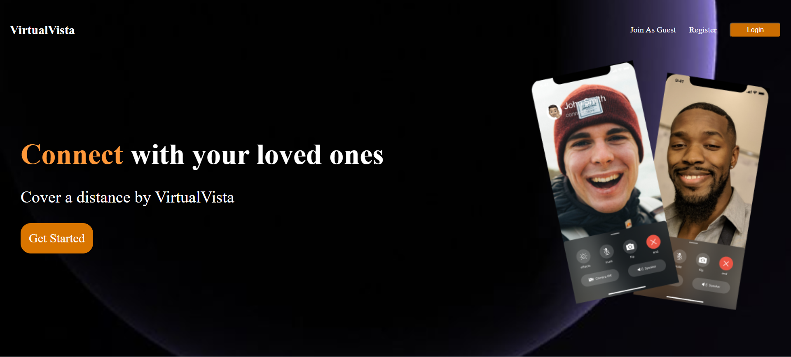
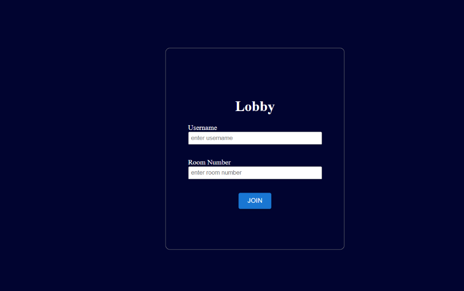
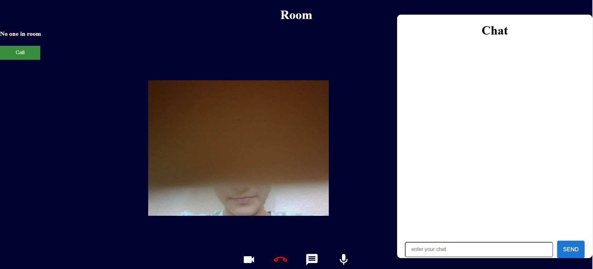
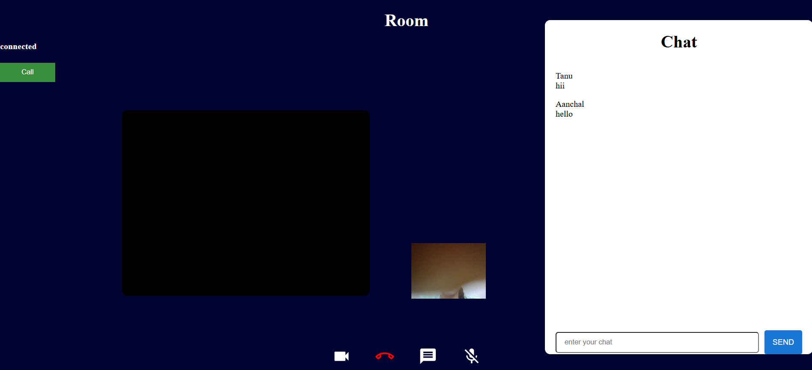

<h1 align="center">VirtualVista 📞</h1>

  <strong>VirtualVista offers direct peer-to-peer video connections with instant messaging!</strong>

_______

  
  

## Features
- Real-time Video Calls: Users can connect for one-on-one video calls
- Text Chat: Send messages during the video call.
- Call Controls:
   &#8226; Connect/Disconnect: Start and end calls with a simple click.
   &#8226; Mute/Unmute Audio: Mute or unmute your microphone during a call.
   &#8226; Video On/Off: Turn your camera on or off during the call.
- Responsive design for desktop and mobile.

## Technologies
- **Frontend**: HTML, CSS, JavaScript, React, Material-UI
- **Backend**: Node.js, Express
- **Real-Time Communication**: WebRTC, Socket.io

  
